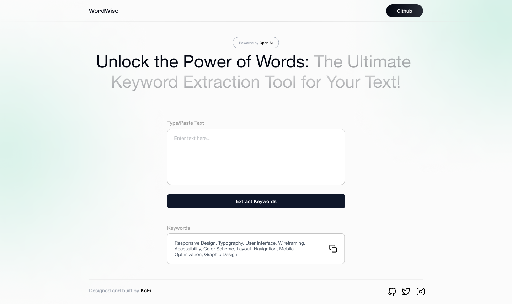

# WordWise

WordWise is a web application that takes blocks of text and extracts the most important keywords to help you quickly understand the main ideas. The app is built with React and Tailwind CSS.

## Getting started

To get started with WordWise, follow these steps:

1. Clone this repository to your local machine
2. Install the dependencies with `npm install`
3. Start the development server with `npm run dev`
4. Open [http://localhost:3000](http://localhost:3000) in your browser

## Usage

To use WordWise, simply paste a block of text into the input field and click the "Extract Keywords" button. The app will generate a list of the most important keywords based on the text you provided.

## Contributing

If you would like to contribute to WordWise, please follow these steps:

1. Fork this repository
2. Create a new branch for your feature or bug fix
3. Make your changes and commit them with descriptive messages
4. Push your changes to your forked repository
5. Open a pull request to this repository with a detailed description of your changes

## License

WordWise is licensed under the MIT License. See [LICENSE](./LICENSE) for more information.
